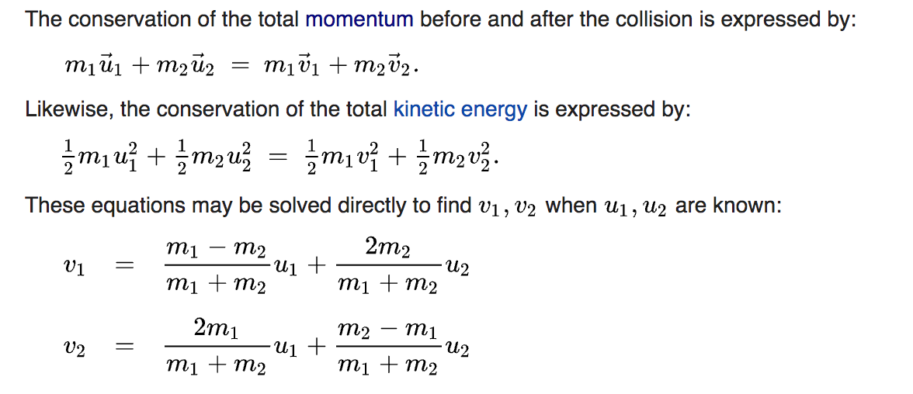
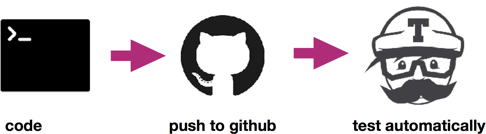
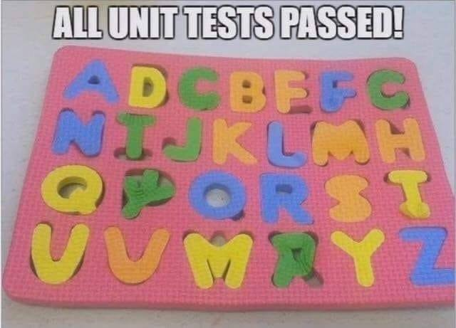

name: inverse
layout: true
class: center, middle, inverse
---
# To trust or to test?: Automated testing of scientific projects with pytest

---
layout: false
###<span style="color:purple">Who are we?</span>


- <span style="color:purple">Dorota Jarecka</span> 
   - McGovern Institute of Brain Research, MIT
   - PhD in Physics
   
- <span style="color:purple">Anna Jaruga</span>
   - Environmental Science and Engineering, Caltech
   - PhD in Physics

---

### <span style="color:purple">Learning objectives</span>


- Why do we write tests?

- What are the various types of software tests?

- How to write simple unit and regression tests?

- What are the testing frameworks in Python?

- What is Continuous Integration?


---
### <span style="color:purple">Setup</span>


#### Python environment

- If you haven't prepared your environment, you can still do it:

  - Install conda: [follow instructions](https://conda.io/projects/conda/en/latest/user-guide/install/index.html)

  - creating an environment:
  ```bash
  $ conda create --name pycon numpy scipy matplotlib pytest hypothesis
  ```


- Checking if you have libraries
    ```bash
    $ python --version
    Python 3.7.3
    ```
    
    ```bash
    $ python -c "import matplotlib; print(matplotlib.__version__)"
    3.0.3
    ```

---
### <span style="color:purple">Setup</span>


#### Text editor and  ffmpeg (for animation)


- you should have your favorite text editor, if you don't, please install jupyter, eg.:

```bash
$ conda install jupyter
```

#### ffmpeg (for animation)

- You can download ffmpeg from [here](https://ffmpeg.org/download.html)

#### Git and GitHub


- if you have to install Git, follow the [instructions](https://git-scm.com/downloads)
  - you can check by typing in your terminal `git --version`

- if you don't have a GitHub account, please [join]( https://github.com/join)

---
name: inverse
layout: true
class: center, middle, inverse
---
## Introduction
---
layout: false

### <span style="color:purple"> Why do we test software?</span>

--

- #### mistakes happen and always will

---
### <span style="color:purple"> Why do we test software?</span>


--


---
### <span style="color:purple"> Why do we test software?</span>


--

- It started harmlessly:

  - *A team member was doing a bit of maintenance on Amazon Web Services Tuesday...*

--

  - *With a few mistaken keystrokes, ...*

--

  - *... The cascading failure meant that many websites could no longer make changes to the information stored on Amazon's cloud platform....*

--
- Amazon said: *We have modified this tool to remove capacity more slowly and **added safeguards to prevent** capacity from being removed when it will take any subsystem below its minimum required capacity level.*

--

<span style="color:purple">**Including tests is one of the possible safeguards when writing software!**</span>

---
### <span style="color:purple"> Why do we test software?</span>

#### And now a scientist's nightmare...

--

- A Prof. Geoffrey Chang story who had to retract 5 articles (3 from *Science*, *PNAS*, *J.Mol.Biol.*)

&nbsp;


&nbsp;

- *An in-house data reduction program introduced a change in sign...*

---
### <span style="color:purple"> Why do we test software?</span>


- makes you think about desirable output

--

- improves readability of your code
   
   - good usage examples for others and your future self
   
   - helps to reuse your code

--

- raises your confidence when developing the code


---
###<span style="color:purple">Various types of tests</span>

--

- Unit tests

  - work on isolated parts (units) of the program
  - verify that units operate correctly in various scenarios
  - usually compare observed results to well known expected results


- Integration tests

  - combine individual software modules and test as a group
  - similar structure as unit tests: compare observed results to  expected results, but the expected result can be more complicated to represent

&nbsp;

--

- Regression tests

  - verify that software previously developed and tested still performs correctly even after it was changed or interfaced with other software

  - you don't have to knows the expected result, the assumption is that the past results were correct.

---

### <span style="color:purple">Science and software testing</span>

- We all question/test many things in our scientific work

- When writing a program we often execute a simple example first and check the output

&nbsp;

--

#### Writing software tests for your scientific code is:

  - translating your ideas for verification to programming code

  - automating the process of verification, so you can do it on a regular basis


---
name: inverse
layout: true
class: center, middle, inverse
---
## Testing tools
---
layout: false

### <span style="color:purple">Python testing frameworks</span>

- unittest

- nosetests

- pytest


&nbsp;

--

Which framework should you use?

- A great comparison of the frameworks you can find [here](http://pythontesting.net/start-here/)

- A short answer: **use pytest if you can**


---
### <span style="color:purple">Unit tests with Pytest library</span>


- it’s easy to get started

- straightforward asserting with the assert statement

  ```python
  def test_1():
      assert 4 - 3 == 1

  def test_2():
      assert 4/3 > 6/5

  def test_3():
      assert "l" in "lalala"
  ```

- helpful traceback and failing assertion reporting

- automatic test discovery

  ```bash
  # discovers all tests in all subdirectories
  pytest
  # runs all test from test_myfunction.py file only
  pytest tests_myfunctions.py
  # runs one specific test
  pytest tests_myfunctions.py::test_one_specific_test
  ```

- many useful features including fixtures, test parameterization, etc., 
that will be covered during the tutorial

---
### <span style="color:purple">Unit tests with Pytest library</span>

#### Additional options to pytest command 

- `-v` (`--verbose`): increase verbosity
  ```bash
  pytest -v
  ```

- `-s`: shortcut for --capture=no (can see print statements)
  ```bash
  pytest -s
  ```

- `--pdb`: start the interactive Python debugger on errors
  ```bash
  pytest --pdb
  ```

- `-h` (`--help`): full list of option
  ```bash
  pytest -h
  ```
---

name: inverse
layout: true
class: center, middle, inverse
---
## Our scientific project 
---
layout: false

### <span style="color:purple"> Simulation of moving particles in a box...</span>

Assumptions:

- all particles have the same sizes, but can have different masses,

- box is rectangular,

- all collisions are elastic, 

- particles have different initial location and velocities.

---
#### <span style="color:purple"> Simulation of moving particles in a box...</span>

<video src="img/sim.mp4" controls preload></video>


--

- Does it work?

--

- Is it correct?

---

#### <span style="color:purple"> Simulation of moving particles in a box...</span>

It might be hard (impossible?) to write a test that can give the absolute answer...

--

...but we can think about multiple tests that increase our confidence!

--

Think about individual processes: 

- transport

- particles collisions 

- hitting the wall

---

#### <span style="color:purple"> Testing transport </span>

Code is in:

```bash
~/pycontest/pycontest/transport.py
```

Tests will be in:
```bash
~/pycontest/tests/test_transport.py
```

--

Solution for the code is in:

```bash
~/pycontest/solutions/transport.py
```

--

- read about [skip/xfail](https://docs.pytest.org/en/latest/skipping.html)

---

#### <span style="color:purple"> Testing collisions: 1d </span>



---

#### <span style="color:purple"> Testing collisions </span>


##### Discuss the possible tests for 1d elastic collisions.

--

Code is in:

```bash
~/pycontest/pycontest/elastic_collisions.py
```

Tests will be in:
```bash
~/pycontest/tests/test_elastic_collisions_1d.py
```

--

Examples of tests:

```bash
~/pycontest/solutions/test_elastic_collisions_1d.py
```

-  check [pytest.approx](https://docs.pytest.org/en/latest/reference.html#pytest-approx)

--

##### After testing 1d, we can think about tests for 2d

Tests will be in:
```bash
~/pycontest/tests/test_elastic_collisions_2d.py
```

---

#### <span style="color:purple"> Testing simulation </span>


##### Testing entire simulation

Code is in:

```bash
~/pycontest/pycontest/simulation.py
```

Tests will be in:
```bash
~/pycontest/tests/test_simulation.py
```

- read about [parametrization](https://docs.pytest.org/en/latest/parametrize.html) and try to use it within your test functions

- read about [exceptions check](https://docs.pytest.org/en/latest/assert.html#assertions-about-expected-exceptions), try to use it in your existing tests and write new tests

--

##### Using fixture in the tests

Check the test:
```bash
~/pycontest/tests/test_simulation_fixture.py
```

- read about [fixture](https://docs.pytest.org/en/latest/fixture.html)

---

### <span style="color:purple">Regression test </span>

- In scientific computing sometimes (often?) we don't know what is the ''correct'' output

- We can eyeball the plots we create and deem them reasonable, but errors are still possible.

- In the absence of truth we can test if our current results are the same as our reference results.

- This ensures that the functionality we already have is not lost when we add new features or update packages.

--

<span style="color:purple">**Add a regression test.**</span>
```bash
~/pycontest/tests/test_regression.py
```
Example solution:
```bash
~/pycontest/solutions/test_regression.py
```

check [np.testing.assert_allclose](https://docs.scipy.org/doc/numpy/reference/generated/numpy.testing.assert_allclose.html)

---
### <span style="color:purple">Pytest + Hypothesis </span>

- [Hypothesis](https://hypothesis.readthedocs.io/en/latest/)
  package allows to specify expected range of values of your inputs.
  It tests for many combinations of values of input parameters.

- tutorial here at Pycon: [Escape from auto-manual testing with Hypothesis!](https://us.pycon.org/2019/schedule/presentation/91/) 

--
- our simple example will need:

  ```python
  from hypothesis import given, strategies as st                                 
   
  @given(mass1  = st.floats(min_value=.1, max_value=1e3),                        
         mass2  = st.floats(min_value=.1, max_value=1e3))                        
  def test_hypothesis(mass1, mass2):  
  ```
--
<span style="color:purple">**Add a test that uses hypothesis to check if kinetic energy is conserved.**</span>
```bash
~/pycontest/tests/test_hypothesis.py
```
Example solution:
```bash
~/pycontest/solutions/test_hypothesis.py
```

---
### <span style="color:purple">Automated testing </span>

  - Pros:
      - Build and check the code every time you (and others) change it
      - Get immediate feedback
      - Easily integrate testing into your workflow
      &nbsp;
      - Use various environments for testing the code
--

  - Continuous Integration Services

      - [Travis CI](https://travis-ci.org/)
      - [CircleCI](https://circleci.com/)
      - ...

                                       


---
### <span style="color:purple">Automated testing: Integrate Travis CI with GitHub </span>

- Have GitHub account

- Create Travis CI account at [travis-ci.org](https://travis-ci.org/)
  (sign in with your GitHub account)

- Choose the repos you want to test with Travis CI

- Add `.travis.yml` file to your repo.
  This file should contain all the commands needed
  to build your project on a fresh Linux or OSX machine.

  ```bash
  language: python
  
  python:
      - "3.6"
  
  install:
      - pip install scipy numpy matplotlib hypothesis
  
  script:
      - py.test -s -v tests
  ```
- see Travis CI test report at GitHub

---
### <span style="color:purple">Automated testing: Integrate Travis CI with GitHub </span>

- you can specify in settings when Travis CI should be run
  (every new pull, every commit, branches)

- get notifications via email, slack, etc

- get fancy badge in your repo: in `README.md` add:

  ```bash

  | **Build Status**                                                                                                       
  |:------------------------------------|
  | [![travis][travis-img]][travis-url] |

  [travis-img]: https://travis-ci.com/your_github_account/your_repo.svg?branch=master
  [travis-url]: https://travis-ci.com/your_github_account/your_repo
  ```

---
### <span style="color:purple">Check test coverage: Codecov </span>

- Create Codecov account at [codecov.io](https://codecov.io)
  (sign in with your GitHub account)

- Choose the repos you want to test with Codecov

- Update your `.travis.yml`:
 
  ```bash
  language: python
  
  python:
      - "3.6"
  
  install:
      - pip install scipy numpy matplotlib hypothesis
      - pip install codecov pytest-cov
  
  script:
      - py.test --cov=./ --cov-report xml:cov.xml tests                          

  after_success:                                                                 
      -  codecov --file cov.xml 

  ```
- see Codecov report at GitHub

---
### <span style="color:purple">Check test coverage: Codecov </span>

- get fancy badge on your repo: in `README.md` add:

  ```bash
  | **Build Status**                                                                                                       
  |:----------------------------------------------------------------------------|
  | [![travis][travis-img]][travis-url]  [![codecov][codecov-img]][codecov-url] |

  [travis-img]: https://travis-ci.com/your_github_account/your_repo.svg?branch=master
  [travis-url]: https://travis-ci.com/your_github_account/your_repo

  [codecov-img]: https://codecov.io/gh/your_github_account/your_repo/branch/master/graph/badge.svg
  [codecov-url]: https://codecov.io/gh/your_github_account/your_repo          
  ```

---
### <span style="color:purple">External resources</span>

- [Software Carpentry](http://katyhuff.github.io/python-testing/index.html)

- [pythontesting blog](http://pythontesting.net/) and [pythontesting book](https://pragprog.com/book/bopytest/python-testing-with-pytest)

- [Obey the Testing Goat!](https://www.obeythetestinggoat.com/)

--

- Examples of animation taken from [this tutorial](http://jakevdp.github.io/blog/2012/08/18/matplotlib-animation-tutorial/?ref=analisted)

---
### <span style="color:purple">Scientific testing examples</span>

- No excuses for not writing unit tests!

- Sometimes you can use tests proposed in [existing publications](https://github.com/igfuw/libmpdataxx/tree/master/tests/mp3_paper_2018_JCP)

- Sometimes you are left with regression testing against your [own published results](https://github.com/igfuw/libmpdataxx#3-to-reproduce-all-results-from-the-gmd-paper)
  (But wouldn't it be nice to be able to automatically generate all your previously 
   published plots and results?)

  &nbsp;

- Try to:
    - write your code and your tests together
    - think of any analysis / plotting code as a potential test
    - automate
---
  &nbsp;
                                       
  taken from [Keith Smiley](https://twitter.com/SmileyKeith/status/557657449503948802)
---

### <span style="color:purple">Acknowledgments</span>

- Big part of the presentation comes from ReproNim teaching materials

- Check [the website](http://www.repronim.org/teach.html) for more resources

 
---


name: inverse
layout: true
class: center, middle, inverse
---
# Questions?
